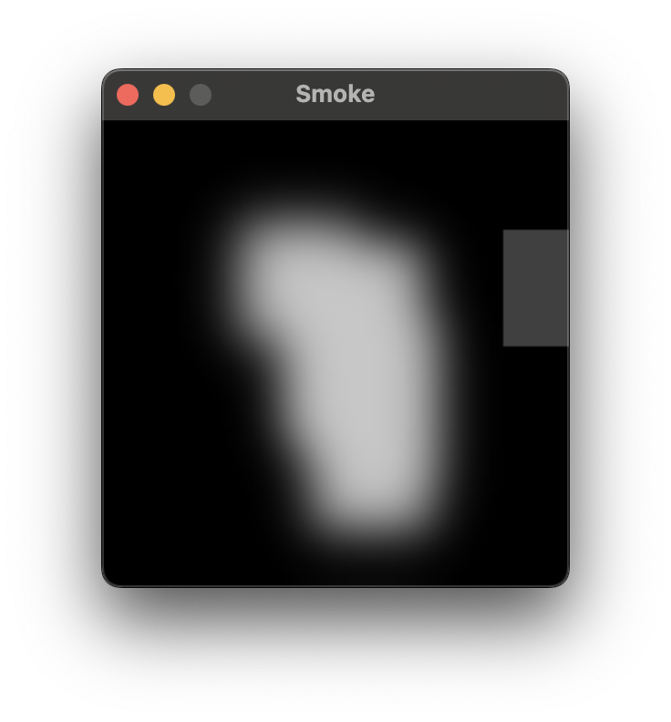

# Project Specification Musings

2026-03-05

This blog entry is written a tad late. Sorry about that.

Our initial idea was to create a Bernoulli effect simulation, suspending a ping pong ball in the air. We wanted to use an Eulerian approach, i.e. simulating
the air flow using a grid, but it was surprisingly difficult to find resources regarding two-way interaction, that is the ball should influence the air, and
the air should influence the ball. As such, we made the decision to focus on one-way interactions for this project, leaving two-way interactions as a point
of further study. This should keep it manageable within our given time frame. One of our main goals is however to further our understanding of grid-based
fluid simulations such that we in the future would be able to implement a two-way simulation.

The basic idea as it currently stands is then to simulate smoke envolping a ball rather than suspending it in the air. We found a resource that explains a
general algorithm for solving the Navier-Stokes equations when representing the fluid as a grid. It is written by Joe Stam and called Real-Time Fluid Dynamics
for Games. He does not cover the aspect of actually adding smoke or objects to the fluid, but mentions them as possible (and easy) extensions.
As an initial implementation, we will be following his methods closely. We are aiming for a real-time simulation, making his methods an obvious choice, being
related to games and all.

We did find a fun little website (https://rachelbhadra.github.io/smoke_simulator/index.html#contributions) that has a similar feel to what we wish to accomplish.

That is it for now.

# Ini the Beninging

2026-03-06

Listen Properly! (https://www.youtube.com/watch?v=TWEp_Z9gLCo)

Before we can begin work on the implementation, we require a way to visualize our results; it tends to help with debugging. For this purpose, we created a 
github repository added SDL3 as dependency. Indeed, the repository was created as part of the previous blog, though it was left unmentioned, but seeing as
this blog entry was written a few hours away from the previous one, we shall treat it as a continuation. To make building and running the program as painless
as possible, we opted to statically link SDL and use a bit of CMake magic to not have to do anything manually for different platforms.

After a bit of work, the basic parts of the program were implemented. A main requirement was to be able to draw colors for individual pixels. As such, we
used an SDL texture with streaming enabled allowing us to lock the texture and write to it as if it were regular memory. We may in the future transition to
a GPU-based implementation, but because the article Real-Time Fluid Dynamics for Games by Joe Stam is CPU-based, it would likely complicate the project. In
any case, writing directly to a texture is about as good as it gets for a CPU-based solution, and our focus should be on the physics rather than implementation
details.

The current version allows us to write to the texture using the mouse, updating the density of the fluid in a small area around the cursor. This is just basic
test functionality that will eventually be used to add smoke to the simulation. The visualization aspect just draws these parts red, as shown in the image below.

We also made sure to have a fixed timestep for the simulation. How it works is that we accumulate the time between each iteration of the main loop and increment
a counter. After it is at least as large as our chosen timestep (a sixtieth a second), we update the simulation. Rendering is therefore performed as fast as
possimpible, but the simulation can use a fixed timestep. This avoids any nasty numerical issues when the delta time becomes very large or very small.

The next step is to begin with the actual physics.

# Initial Implementation of the Physics
2026-03-08

Now that rendering to the screen works, we can begin with the physics! We are following the article Real-Time Fluid Dynamics for Games by Joe Stam, which describes a method for solving the Navier-Stokes equations on a grid.

Conveniently, the article implements the method in C and we are using C as well. While it would essentially be possible to copy paste the code, however this would not be very educational. Therefore, we implemented the method with the article as a reference, but without blindly copying code without understanding it. When implementing the various steps of the method from the article, we made sure to understand the underlying mathematics, physics and programming and add additional comments that explain what the code is doing and why. Furthermore, this helps us to be able to debug and modify the method as required to add boundry conditions, and in the future two-way interactions.

As a broad overview, the method works by splittig the simulation into a density step and a velocity step. The density step updates the density field by diffusing (spreading out) and advecting (transporting) the density field. The velocity step updates the velocity field by diffusing, advecting and projecting the velocity field. Projecting is done to ensure that the velocity field is divergence-free to ensure fluids are incompressible.

The initial implementation was partially successful as diffusion worked. However, there was a bug in the velocity step which prevented the fluid from being simulated properly. This made the simulation slowly fade away, but the fluid would not move much even when adding velocity every frame.

After some debugging, we found that the bug was due to the old velocity values being used when the current ones should have been used. This was easily fixed by correctly swapping the old and current velocity fields. This produced the first working version of the simulation. There are however some artifacts in the simulation due to the velocity being set in a weird way.

<video src="./blog-assets/video22.mp4" controls autoplay loop></video>

https://github.com/user-attachments/assets/9ab122c4-67b9-48f9-b280-ff642c00b8bb

After some further tweaks such as changing the color scheme, making the velocity of the created smoke follow the direction of the cursor and some adjustments to the time stepping (especially when the window was moved) the following results were produced.

<video src="./blog-assets/video23.mp4" controls autoplay loop></video>

https://github.com/user-attachments/assets/bb90b319-29ca-4776-8825-a02786470bab

Now it's really starting to look like a smoke simulation! The next step is to add boundry conditions and objects to the simulation.
